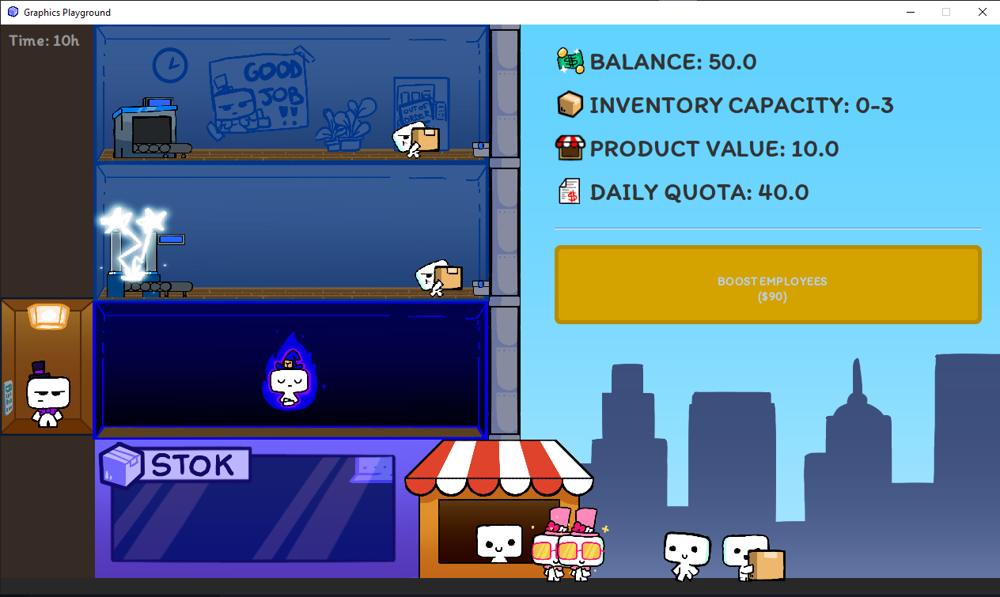

# Economy35

**Economy35** is an idle game developed in Java, designed as a school project to implement an example of the *producer-consumer thread model*. In this game, the player takes on the role of a company leader, managing resources, employees, and upgrades to maximize profits and grow the business.

It was developed in Java without using any external libraries beyond those integrated into the language.

You can download the game here: https://cupflow-studios.itch.io/economy35

## Game Description

The game features a strategic gameplay loop with the following elements:

- **Dynamic inventory**: Machines produce packages, which are transported by employees. Customers purchase packages, generating revenue.
- **Revenue management**: A portion of daily revenue is deducted as taxes. If you fail to meet the minimum threshold, the game ends.
- **Upgrades**: Invest in upgrades to increase product value, speed up production, expand inventory, hire more employees, and more.
- **Day cycle**: Time progresses, triggering specific events at the end of each day.
- **Floor navigation**: Players can move between different floors of the building using an elevator.



## Technologies Used

- **Language**: Java
- **Graphical interface**: Swing
- **Code structure**: Divided into a custom library (`engine` folder) and the main game.

### Custom Library: `engine`

To simplify development and enhance performance, we developed a custom library containing utilities such as:

- Management of audio, graphics, and resources (`SoundManager`, `GraphicsManager`, `ResourceManager`).
- A node-based system for organizing game objects.
- Detailed documentation and Javadoc (see [engine-docs.md](./engine-docs.md)).

## Installation and Launch

### Requirements

- **Java Runtime Environment**: Version `17.0.9` or higher to run the jar file.
- Windows OS for running the `.exe` file (optional).

### Required File Structure

Ensure the main folder contains the following structure for the game to function correctly:

```
main
├───audio
│   ├───music
│   └───SFX
├───sprites
│   ├───subfolders
└───UI
    └───fonts
economy35.jar / .exe

```

### Download and Launch

1. Download the latest release from the repository) or on itch.io.
2. To start:
    - **Jar**: Double-click or use the command `java -jar economy35.jar` in the console.
    - **Exe**: Run the `.exe` file directly.

### Manual Compilation

To compile the project manually:

1. Clone the repository.
2. Use Gradle to build executable files:
    - `.jar`: `./gradlew build`
    - `.exe`: `./gradlew createExe`

## Project Structure

The project is organized as follows:

```
src/main/java/org/cup
├── assets           # Resource management (audio, graphics, logic)
    ├── audio        
    ├── compnents    # Nodes that intended to work attached to objects
    ├── objects      # Main game classes (machines, customers, employees, etc.)
    ├── logic        # Classes for thread management and other logic
    ├── managers     # Specialised nodes that can only have one instance
    ├── scenes       # Object containers
    ├── sprites      
    ├── UI           # Handles UI integration such as buttons
├── engine           # Custom library to optimize the development process
├── scenes           # Game scenes (main menu, tutorial, main gameplay)
├── UI               # Custom graphical elements (buttons, labels, panels)
└── Main.java        # Application entry point

```

For more details, consult the Javadoc documentation or the [engine-docs.md](./engine-docs.md) file.

## Contributions

**Development Team:** This project was created as a team-based school exercise. For inquiries or contributions, feel free to open an issue or contact the developers via the repository or [Discord server](https://discord.gg/y65xHCFWE8). Refer to the license for guidelines on modifying the game. Thanks to [SO_Snake](https://www.youtube.com/@SO_Snake) for providing music for this game.

## Licensing

This repository is licensed under multiple licenses:
- **Code**: GNU General Public License v3 (see [LICENSE.md](LICENSE.md)).
- **Art Assets**: Creative Commons Attribution-ShareAlike 4.0 (see [art-license.md](src\main\java\org\cup\assets\sprites\art-license.md)).
- **Sound and Music**: Third-party assets with separate licenses (see [audio-license.md](src\main\java\org\cup\assets\audio\audio-license.md)).

### Summary of License Terms
1. You can modify and redistribute the code, provided you release it under GPL v3.
2. You can use, adapt, and redistribute the art assets, provided you give credit and use the same CC BY-SA 4.0 license.
3. Sound and music files may have additional restrictions. Please refer to [audio-license.md](src\main\java\org\cup\assets\audio\audio-license.md).
---